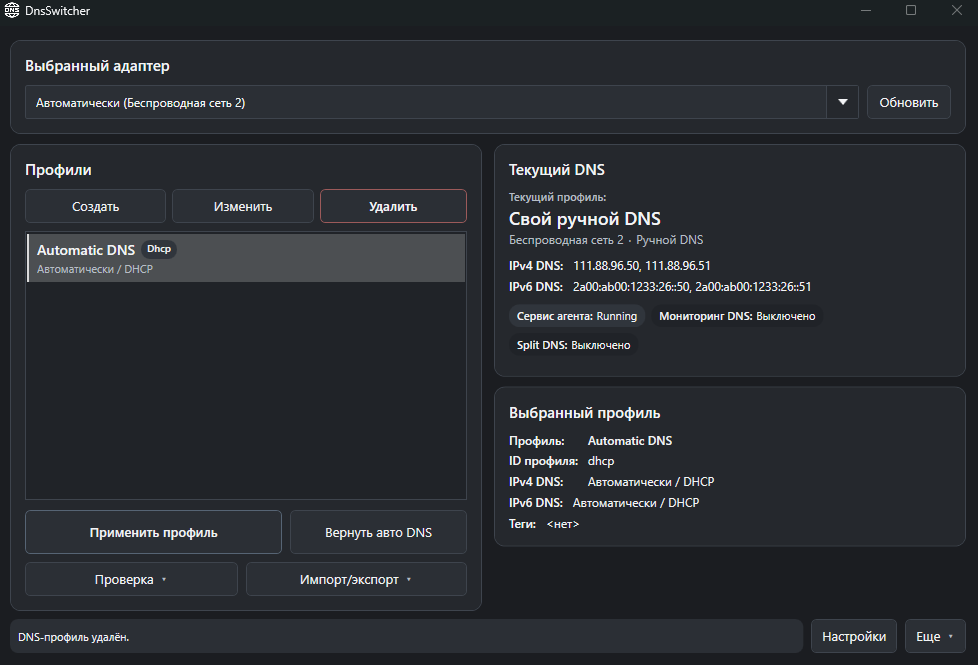
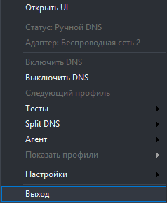
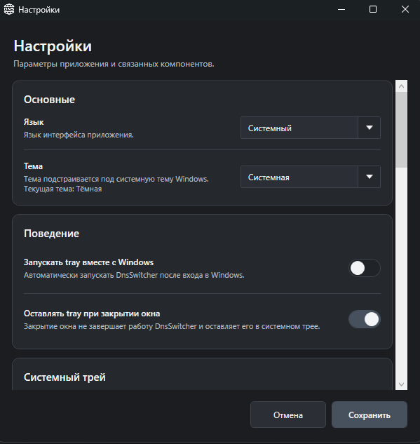
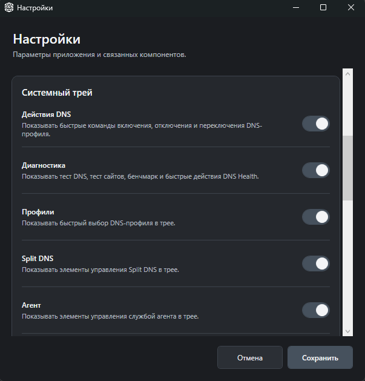
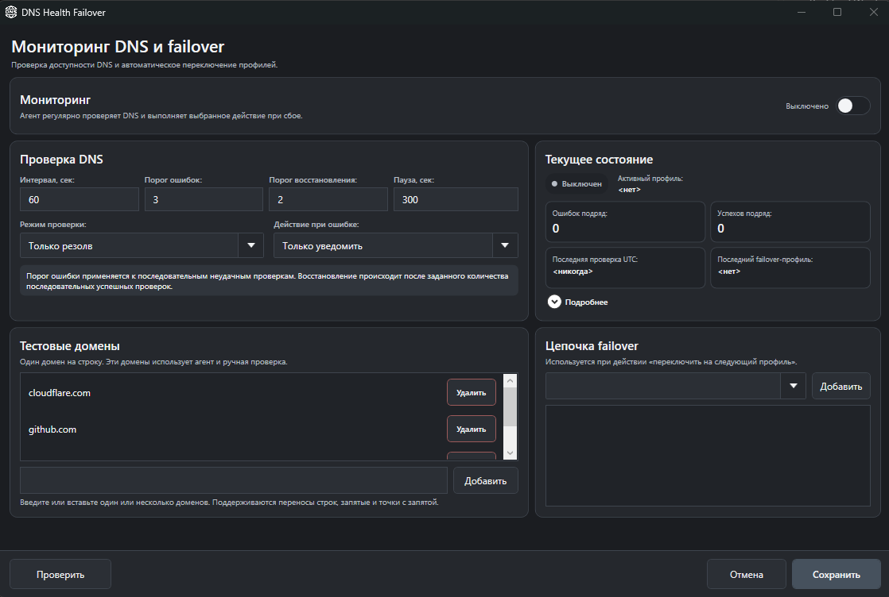
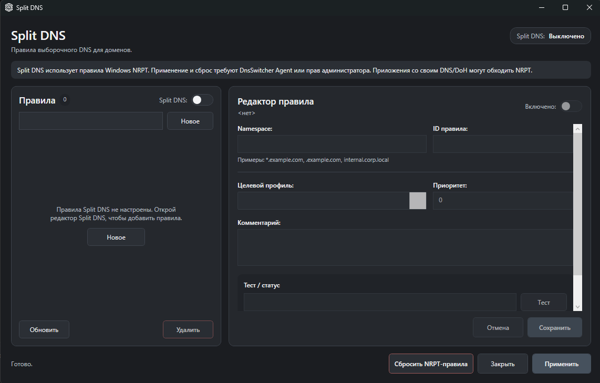

<div align="center">

# DnsSwitcher

Быстрое переключение DNS-профилей в Windows через приложение, системный трей или CLI.

**Русский** · [English](README_EN.md)

[](https://github.com/Regstar2/dns-switcher/releases/tag/v1.5.0)
[](#требования)
[](https://github.com/Regstar2/dns-switcher/actions/workflows/ci.yml)
[](LICENSE.md)

[Скачать](https://github.com/Regstar2/dns-switcher/releases/tag/v1.5.0) · [Быстрый старт](#быстрый-старт) · [Документация](#документация) · [История изменений](CHANGELOG.md)

</div>

## О проекте

DnsSwitcher — Windows x64-приложение для сохранения и применения DNS-профилей, диагностики DNS/сайтов, DNS Health Failover и Split DNS через Windows NRPT. Привилегированные операции могут выполняться через Windows Agent по Named Pipes.

## Статус проекта

Текущая стабильная версия — **v1.5.0**. Основные сценарии UI, Tray, CLI, Agent, DNS Health, Split DNS, installer/portable и обновления прошли финальную Windows-проверку.

## Возможности

- DNS-профили с быстрым применением и возвратом к автоматическому DNS;
- WPF UI, настраиваемое меню системного трея и CLI;
- создание, редактирование, импорт и экспорт профилей;
- DNS-, site- и benchmark-диагностика;
- DNS Health Failover с thresholds, cooldown и fallback-профилями;
- Split DNS через Windows NRPT;
- Windows Agent для привилегированных операций;
- русский и английский интерфейс, темы System / Light / Dark;
- отдельные разделы **О приложении** и **Помощь**;
- ручная и отключаемая автоматическая проверка обновлений;
- проверка SHA-256 перед запуском скачанного installer.

## Скриншоты

| Главное окно | Системный трей |
|---|---|
|  |  |

| Настройки | Настройки трея |
|---|---|
|  |  |

| DNS Health | Split DNS |
|---|---|
|  |  |

Дополнительные снимки находятся в [`docs/assets/screenshots/`](docs/assets/screenshots/).

## Быстрый старт

1. Скачайте `DnsSwitcher-1.5.0-win-x64-setup.exe` из [GitHub Release v1.5.0](https://github.com/Regstar2/dns-switcher/releases/tag/v1.5.0).
2. Установите приложение.
3. Создайте или импортируйте DNS-профиль.
4. Выберите сетевой адаптер и примените профиль.
5. Используйте **Вернуть автоматический DNS**, когда статическая настройка больше не нужна.

Portable-вариант доступен как `DnsSwitcher-1.5.0-win-x64.zip`.

## Требования

- Windows x64;
- административные права для установки Agent и системных DNS/NRPT операций;
- .NET 10 SDK требуется только для сборки из исходников.

Installer и portable package self-contained и не требуют отдельной установки .NET Desktop Runtime.

## Установка

Stable release содержит:

```text
DnsSwitcher-1.5.0-win-x64-setup.exe
DnsSwitcher-1.5.0-win-x64.zip
SHA256SUMS.txt
```

Перед ручным запуском installer можно сверить SHA-256 с `SHA256SUMS.txt` из того же релиза.

## Использование

Основные CLI-команды:

```text
profiles
adapters
status
apply <profile-id>
reset
test
test-sites
benchmark
health <...>
split-dns <...>
service <install|reinstall|uninstall|start|stop|status>
```

Для повседневной работы можно использовать только UI и Tray; CLI нужен для автоматизации и диагностики.

## Конфигурация

Пользовательские данные хранятся в `data/`:

```text
data/
  config/
    app-preferences.json
    profiles.json
    tray-settings.json
    ui-settings.json
    dns-health-settings.json
    dns-health-state.json
    split-dns-rules.json
    update-state.json
  logs/
```

При обновлении установленной версии содержимое `data/config/` сохраняется. Portable-пользователям рекомендуется сохранять каталог `data/` при замене файлов приложения.

## Архитектура

```text
UI / CLI / Tray
       │
       ├──> DnsSwitcher.Core
       └──> DnsSwitcher.Infrastructure.Windows
                    ├── Windows DNS / NRPT / storage
                    ├── update delivery
                    └── Named Pipes ──> DnsSwitcher.Agent.Windows
```

Подробности: [`docs/architecture/architecture.md`](docs/architecture/architecture.md).

## Безопасность

- update client не содержит PAT, OAuth token или другого встроенного GitHub secret;
- installer запускается только после совпадения SHA-256;
- принимаются только ожидаемые HTTPS GitHub release URLs настроенного репозитория;
- runtime config, logs и локальные профили исключены из Git.

## Приватность

DnsSwitcher не требует облачной учётной записи и хранит конфигурацию локально. Автоматическая проверка обновлений выполняет только запрос к release source и может быть отключена в Settings.

## Обновление

Установленную версию можно обновить поверх предыдущей через Inno Setup installer; профили и настройки сохраняются. В приложении есть ручная проверка и отключаемая автоматическая проверка обновлений.

Встроенная проверка обновлений использует публично читаемый GitHub Releases source без токена: DnsSwitcher получает metadata, выбирает ожидаемый installer asset, скачивает `SHA256SUMS.txt` из того же релиза и проверяет SHA-256 перед запуском installer.

## Сборка

```powershell
dotnet restore DnsSwitcher.sln
dotnet build DnsSwitcher.sln -c Release --no-restore
dotnet test DnsSwitcher.sln -c Release --no-build
```

Installer:

```powershell
.\installer\build-installer.ps1 -Version 1.5.0 -Runtime win-x64
```

SDK закреплён в [`global.json`](global.json).

## Тестирование

Финальная версия прошла автоматические тесты и ручную Windows-проверку основных сценариев, включая DNS apply/reset, Agent, Health Failover, Split DNS, Tray customization, installer/portable, upgrade preservation, RU/EN и масштабирование интерфейса.

Планы и evidence: [`docs/testing/`](docs/testing/).

## Документация

- [Индекс документации](docs/README.md)
- [Архитектура](docs/architecture/architecture.md)
- [Release notes v1.5.0](docs/releases/v1.5.0.md)
- [DNS Health Failover](DNS_HEALTH_FAILOVER.md)
- [Split DNS](SPLIT_DNS.md)
- [Installer](INSTALLER_RELEASE.md)
- [Portable package](PORTABLE_RELEASE.md)
- [CHANGELOG](CHANGELOG.md)

## Ограничения

- поддерживается только Windows x64;
- Split DNS основан на NRPT и может обходиться приложениями с собственным DNS/DoH stack;
- точная минимальная версия Windows пока не закреплена отдельным project property.

## Лицензия

MIT — [`LICENSE.md`](LICENSE.md).
